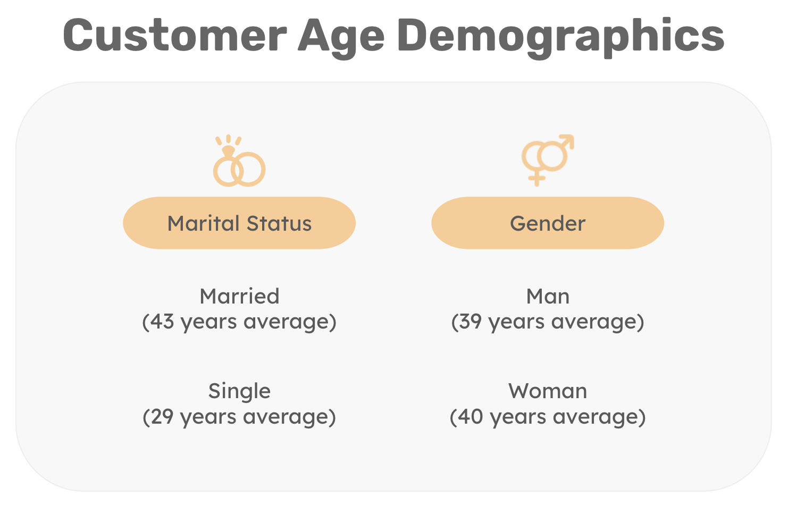
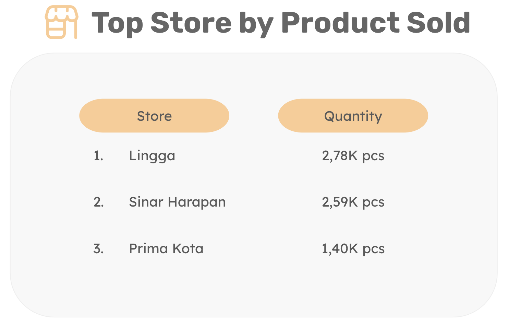

# Sales Performance Dashboard
Tools: <br>
👩🏻‍💻 Visual Studio Code <br>
👩🏻‍💻 PostgreSQL, DBeaver <br>
🗂️ GitHub <br>
📊 Tableau

## Project Background 
KALBE Nutritionals is a company engaged in the health food and drink business whose mission is 'Providing the Best Nutrition Solution for a Better Life'. KALBE Nutritionals has various nutritional products for every stage of life, starting from pregnancy preparation and pregnancy, nutrition for babies, children, adults, to the elderly. 

As the final assignment of my virtual internship at Kalbe Nutritionals, I developed predictive data models to improve the company's business, such as:
1. Finding out the projected amount of products sold to enable the establishment of daily inventory for inventory team, and 
2. Creating customer segmentation to provide personalized promotions and sales treatment for marketing team.

## Project Workflow
1. Data Exploration
2. Dashboard Creation
3. Machine Learning Modelling:
	- Quantity prediction
	- Customer Segmentation

## Task 01 : Data Exploration
Data used in this project consist of:
<p align="center">
  <kbd> </kbd> <br>
  Fig.1. Data
</p>

Before designing sales dashboard, I will explore raw data using PostgreSQL. 
<details>
  <summary>SQL Query</summary>
  
  ```sql
-- Average customer age based on marital status
select 
	"Marital Status" ,
	round(avg(age)) age_average
from 
	data.customer c 
group by
	"Marital Status" 
;

-- Average customer age based on gender
select 
	gender,
	round(avg(age)) age_average
from 
	data.customer c 
group by
	gender 
;

-- Top store based on the product sold
select 
	s.storename,
	sum(t.qty) total_qty
from
	"data".store s 
	join "data"."transaction" t 
		on s.storeid = t.storeid 
group by 
	s.storename 
order by
	sum(t.qty) desc 
limit 
	1
;

-- Top product based on sales
select 
	p."Product Name",
	sum(t.totalamount) total_amount
from
	"data".product p 
	join "data"."transaction" t 
		on p.productid = t.productid  
group by 
	p."Product Name"  
order by
	sum(t.totalamount) desc 
limit 
	1
;
  ```
</details>


<p align="center">
  <kbd> </kbd> <br>
  Fig.2. Customer Age Demographics
</p>

<p align="center">
  <kbd> </kbd> <br>
  Fig.3. Top Store by Product Sold
</p>

<p align="center">
  <kbd> </kbd> <br>
  Fig.4. Top Product by Sales
</p>

## Task 02 : Dashboard Design
After exploring the data, I built Sales Performance Dashboard based on the tables previously created. For Interactive Dasboard please click  <a href="https://public.tableau.com/views/KalbeNutritionals-SalesPerformanceDashboard/Dashboard1?:language=en-US&:display_count=n&:origin=viz_share_link">this link</a>

<p align="center">
  <kbd> </kbd> <br>
  Fig.5. <a href="https://public.tableau.com/views/KalbeNutritionals-SalesPerformanceDashboard/Dashboard1?:language=en-US&:display_count=n&:origin=viz_share_link">Kalbe Nutritionlas Sales Performance Dashboard</a>
</p>

From the dashboard, some insights can be seen as follows:
- Total amount of sales per day week for the year chart shows that most sales occur on Saturdays and the least amount of sales occur on Mondays and Tuesdays.
- Most product sold in March and the least quantity of product sold in December.
- Lingga Store has the most sales also quantity of product sold in 2022. On the contrary, Buana Indah Store has both the least amount of sales and quantity of product sold.
- Cheese sticks rank first in terms of total sales, but not necessarily in terms of number of products sold.  Meanwhile, Thai Tea is in first place in terms of the number of products sold, but its total sales do not show significant figures.
<br>

## Task 03 : Machine Learning Modelling
After building interactive dashboard, I built Machine Learning Model to predict sales quantity and customer segmentation. Before building machine learning model, I handle data type correction, null values and duplicated values, also merging the data into one data frame.

### Task 03.1: Quantity Prediction
To predict sales quantity, I'm using one of time series regression model Seasonal ARIMA. Using quantity of product sold in 2022, I divided the data into training and testing data with 80:20 ratio. 

<p align="center">
  <kbd> </kbd> <br>
  Fig.6. Time Series Decomposition
</p>

After decomposing a time series into components doing stationarity check, I chose seasonal part of the model as be seen in the seasonal lags of the PACF and ACF. 

<p align="center">
  <kbd> </kbd> <br>
  Fig.7. ACF and PACF
</p>

I built three SARIMAX models and checked whether the residuals passes the required assumptions, also evaluating the models using MAE, MSE, and MAPE.

<p align="center">
  <kbd> </kbd> <br>
  Fig.8. Time Series Training
</p>
The model1 and model2 both have lowest MAE and MSE, but the residual assumptions are not meet. The model3 SARIMAX model with (p,d,q)(P,D,Q)m = (0,0,0)(1,1,0)7 is the best performance compared to the other models with 31% error.
Thus, we now have a seasonal ARIMA model that passes the required checks and is ready for forecasting. 

<p align="center">
  <kbd> </kbd> <br>
  Fig.9. Time Series Forecasting
</p>
Forecasts from the model for the next one month are shown in Figure above.
<br><br>

### Task 03.2: Customer Segmentation
To build customer segmentation, I'm using customer data with 3 parameters consisting of:
1. Number of products bought
2. Number of transactions
3. Total amount spent

To carry out customer segmentation using K-means algorithm-which is a centroid-based clustering algorithm, normalized data is needed therefore I used the MinMax Scaler.

Using K-Means algorithm, I have to determine the optimal number of cluster. I selected the value of k at the elbow, ie the point after which distortion/inertia starts decreasing in a linear fashion. Thus concluded from the given data that the optimal number of clusters is 3.

<p align="center">
  <kbd> </kbd> <br>
  Fig.10. Elbow Method
</p>

Beside elbow method, from silhouette plot below we have to select the bigger value of the coefficient average and also consider proportional distribution of the clusters formed. Thus for the given data, we can conclude that the optimal number of clusters is 3.

<p align="center">
  <kbd> </kbd> <br>
  Fig.11. Silhouette Method
</p>

Below is a pairplot of each cluster’s parameters. This shows different average characteristics of 3 clusters formed by the model.

<p align="center">
  <kbd> </kbd> <br>
  Fig.12. Cluster Pairplot 
</p>

Cluster characteristics can be seen as below.
<p align="center">
  <kbd> </kbd> <br>
  Fig.13. Cluster Characteristics
</p>

From these segmentation, several marketing strategies can be implemented for each customer group.
1. Regular Customer
	- Recommend products based on their past buying behavior to spark interest in new categories.
	- Encourage customers to spend more by promoting bundles of related products they've purchased before.
2. Mid-Level Customer
	- Develop loyalty programs that reward frequent transactions, encouraging to continue purchasing regularly.
	- Personalized recommendations to new products or upsell complementary items.
3. High-Value Customer
	- Create exclusive programs, offering unique benefits and access to limited-edition products.
	- Offer early access to new product launches or exclusive events to strengthen their loyalty.

## Business Recommendation
1. Inventory Team
	
	Perform an analysis obtained from the dashboard and compare the forecasting results. Then incorporate the forecasts into supply chain and inventory management processes to ensure having the right amount of products available to meet customer demand.
2. Marketing Team

	Carry out personalized marketing strategies based on the characteristics of each customer segment. Conduct in-depth predictions to find out what complementary products are most likely to buy.


